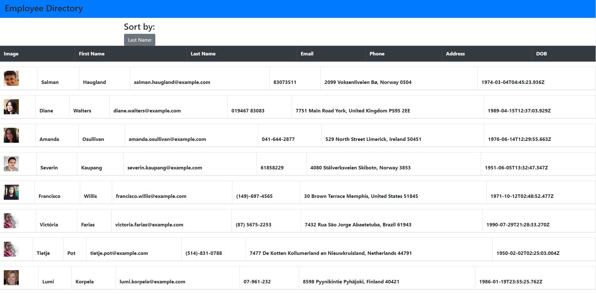
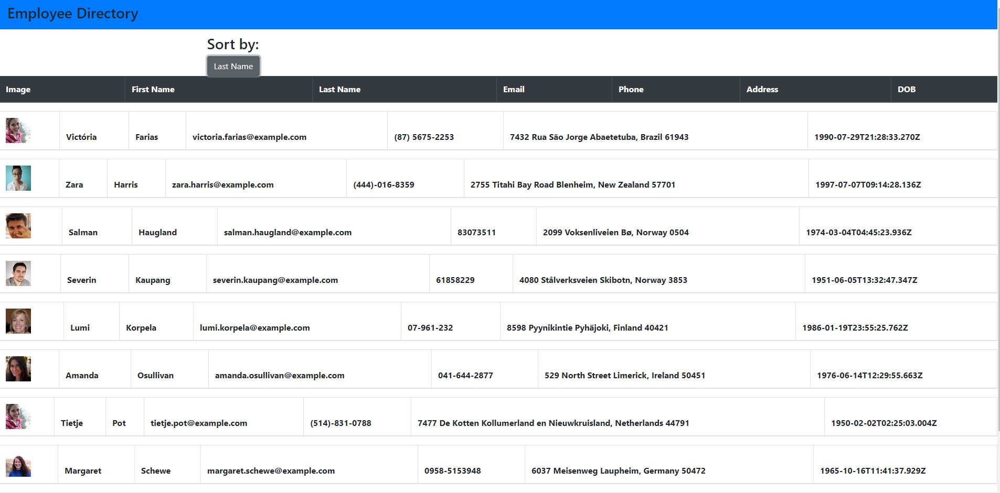

# Employee Directory

  
## Description
  For this project, I was tasked with creating a react application that can render a table of employees whose data is accessed from the "Random User API". The table will load up to 10 results and can be sorted by the employees last name. 

## Table of Contents
- [Description](#description)
- [Installation](#installation)
- [Examples](#examples)
- [Contributing](#contributing)
- [License](#license)

  
## Installation
  To install the project, run npm install. 
  
## Examples

Home Screen
   
   
Sorted By Last Name
   
  
## Contributing
  The project currently needs the functionality of sorting back to the full table of employees. Please feel free to add that functionality. 

## License
  MIT
  

## Questions

  If you have any questions, please feel free to contact me on github.

  Github:Kaileesmith

